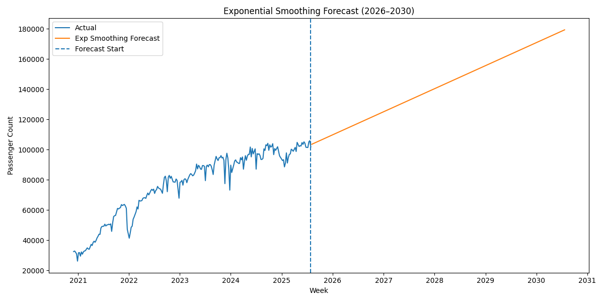
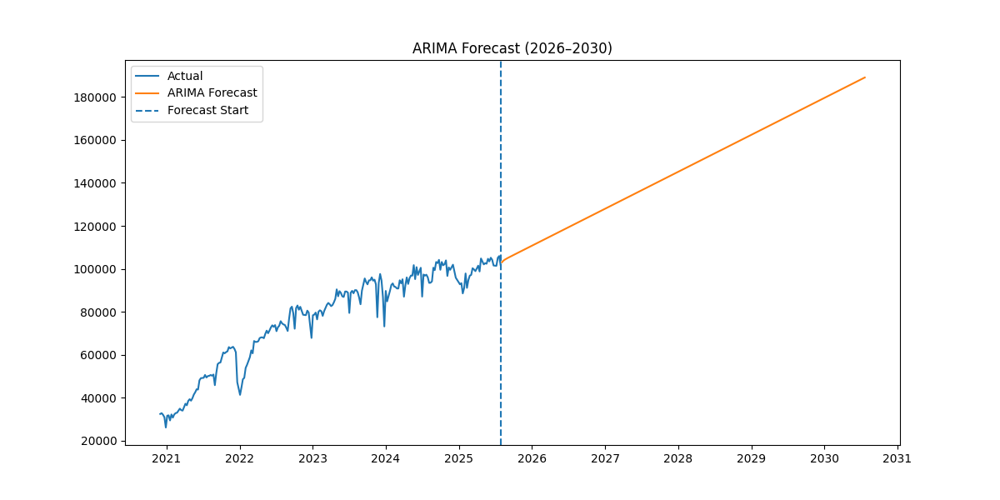

# Port Authority Passenger Forecasting (2026–2030)

## Project Overview
This project represents Phase-2 of a larger data analytics project and focuses on forecasting passenger demand for the Port Authority Bus Terminal using Python time series models.

## Models Used
- Exponential Smoothing (Holt’s Linear Trend)
- ARIMA (Auto ARIMA)

## Evaluation Metrics
- MAE (Mean Absolute Error)
- RMSE (Root Mean Squared Error)

## Results
Exponential Smoothing outperformed ARIMA in terms of both MAE and RMSE, indicating better predictive accuracy for this dataset.

## Forecast Visualizations

The following visualizations compare actual passenger trends with forecasted values using both models.

### Exponential Smoothing Forecast

### ARIMA Forecast

## Key Insights
- Passenger demand shows a steady upward trend
- Seasonal variation was not strong enough to improve model accuracy significantly
- Long-term trend plays a more significant role than seasonality in this dataset

## Tools & Technologies
- Python
- Pandas
- Statsmodels
- pmdarima
- Matplotlib

  ## Power BI Dashboard

A Power BI dashboard complements the forecasting analysis by providing interactive insights into passenger trends.

The dashboard includes:

- Passenger trends over time  
- Comparison with historical baseline (2019)  
- Key performance indicators (KPIs)  
- Interactive filters for deeper analysis  

> Note: Dashboard supports analytical exploration and enhances decision-making through visual insights.

## Files
- `forecast.py` - forecasting code
- `passenger_forcasting_report.pdf` - final report
- `exp_forecast.png` - Exponential Smoothing forecast plot
- `arima_forecast.png` - ARIMA forecast plot
